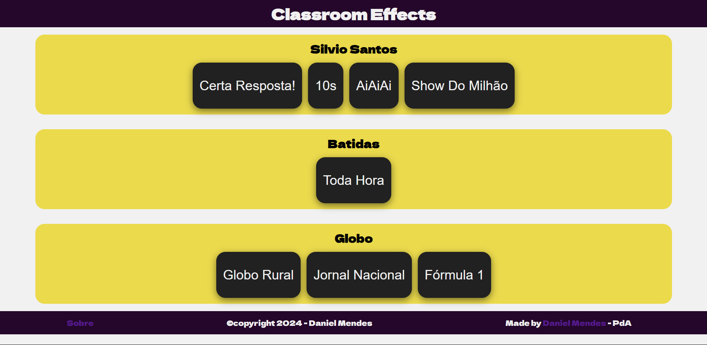

<h1 align="center"> Clasroom Effects - PdA</h1>

## 👀Visão Geral

Tá querendo turbinar suas aulas na PdA usando sonoplastia, mas não quer ficar toda hora abrindo link do youtube? Bom... tá aqui a ferramenta que você facilitador precisa! Com Classroom Effects você deixará suas aulas mais divertidas e dinâmicas com sons diversos. Basta tocar em um botão com o som que desejar

## 📤Last Update

Versão 0.0.2 -> build: Brand New Effects!

## 📸 Screenshots:



## ⚙️ Getting Started

First, run the development server:

```bash
npm run dev
# or
yarn dev
# or
pnpm dev
# or
bun dev
```

Open [http://localhost:3000](http://localhost:3000) with your browser to see the result.

## ⏩ Próximos Passos

- Mixer central para controle de volume e estado(pause/play);
- Deploy;

## 💪🏾 Contribuição

Se você aluno, facilitador, ou qualquer outra frente dentro da PdA e deseja contribuir para este projeto, siga estas etapas:

1. Faça um fork do repositório.
2. Crie uma nova branch: `git checkout -b minha-contribuição`
3. Faça suas alterações e envie um pull request.

Por favor, siga as [diretrizes de contribuição](.github/CONTRIBUTING) para garantir um processo suave.

## 📟 Contato

Para suporte, abra uma issue.

## 🚀 Tecnologias

Esse projeto foi desenvolvido com as seguintes tecnologias:

- React & Next.js
- Typescript
- Git e Github

## 📜 Licença

- Esse projeto está sob a licença [MIT](/LICENSE).

<h3 align="right"> Esse repo é atualizado semanalmente 🌱... </h3>
